# 🌌 ANTIGRAVITY ATOMIC SWARMS
### The Last Workflow You Will Ever Need.

> **"This isn't just a workflow. It's a synthetic pre-frontal cortex for your codebase."**

**Antigravity Atomic Swarms** is a rigorous, self-correcting cognitive architecture designed to turn potential energy into kinetic code. By decoupling the software engineering process into **6 Atomic Phases**, we eliminate hallucination, enforce strict "Global Laws," and enable true self-evolution.

---

## ⚡ Quick Start: From Zero to Singularity

Choose your preferred installation method.

### Option 1: Drag & Drop (Manual)
1.  **Drag and Drop** the entire `workflows` folder directly into your main workspace.
2.  **Initialize**: Open **Antigravity** (Agent Manager Chat works best).
3.  **Ignite**: Type `@` and select the **Agent Rules** file for the phase you need.

### Option 2: The One-Liner (Automated)
Run this command in your project root to instantly install the swarms:

```bash
npx antigravity-atomic-swarms@latest
```

> **⚠️ CRITICAL:** When running a phase, you must select the file from the **`agent/rules`** directory (e.g., `agent/rules/step1-solicitation.md`).

---

## 👁️ System Architecture

### The Core Loop (High Level)
The system operates as a self-correcting cycle.

```mermaid
graph TD
    %% Styling
    classDef phase fill:#0d1117,stroke:#3fb950,stroke-width:2px,color:#fff;
    classDef exit fill:#7d4e00,stroke:#d29922,stroke-width:2px,color:#fff;
    classDef memory fill:#161b22,stroke:#58a6ff,stroke-width:1px,color:#c9d1d9,stroke-dasharray: 5 5;

    subgraph "Core Workflow Cycle"
        direction TB
        
        P0[Phase 0: Solicitation]:::phase
        P1[Phase 1: Multi-Arc Research]:::phase
        P2[Phase 2: SPARC Specification]:::phase
        P3[Phase 3: London TDD Builder]:::phase
        P4[Phase 4: BMO Triangulation]:::phase
        P5[Phase 5: Refinement]:::phase
        
        DONE((✅ Feature Complete)):::exit

        %% Flow
        P0 -->|Context| P1
        P1 -->|Hypothesis| P2
        P2 -->|Spec| P3
        P3 -->|Code| P4
        P4 -->|Pass| DONE
        P4 -->|Fail| P5
        P5 -->|Fix| P4
        DONE -->|Next Feature| P0
    end

    subgraph "The Brain (Memory Architecture)"
        KB[("Knowledge Base")]:::memory
        MS[("Memory Stream")]:::memory
        PS[("Project State")]:::memory
        
        KB <==> P0 & P1 & P2 & P3 & P4 & P5
        MS <==> P0 & P1 & P2 & P3 & P4 & P5
        PS <==> P0 & P1 & P2 & P3 & P4 & P5
    end

    %% Details
    P0 -- "Vision & Gap Analysis" --> P1
    P1 -- "Literature & Strategy" --> P2
    P2 -- "Architecture & Threat Model" --> P3
    P3 -- "Tests & Implementation" --> P4
    P4 -- "Chaos & Verification" --> DONE
```



<details>
<summary><strong>🔍 Click to Expand: "Eye of Providence" (Advanced View)</strong></summary>
<br>
This detailed view exposes the internal sub-phases, infrastructure steps, and cognitive loops within each atomic phase.

```mermaid
graph TD
    %% Styling
    classDef phase fill:#0d1117,stroke:#3fb950,stroke-width:2px,color:#fff;
    classDef subphase fill:#161b22,stroke:#7d8590,stroke-width:1px,color:#c9d1d9,stroke-dasharray: 5 5;
    classDef exit fill:#7d4e00,stroke:#d29922,stroke-width:2px,color:#fff;
    classDef memory fill:#1f2428,stroke:#58a6ff,stroke-width:1px,color:#58a6ff;

    subgraph "Phase 0: SOLICITATION (The Visionary)"
        direction TB
        S0_Start([Start]) --> S0_Infra[Infrastructure Boot]:::subphase
        S0_Infra --> S0_Vis[Phase 1: Vision Statement]:::phase
        S0_Vis --> S0_Canvas[Phase 1.5: Vision Canvas]:::subphase
        S0_Canvas --> S0_Arch[Phase 4: System Architecture]:::phase
        S0_Arch --> S0_Persona[Phase 4.5: Persona Round-Table]:::subphase
        S0_Persona --> S0_Sim[Phase 5: Day in the Life]:::phase
        S0_Sim --> S0_Jury[Phase 9.5: Consensus Jury]:::subphase
        S0_Jury --> S0_Contract[Phase 10: Final Contract]:::exit
    end

    subgraph "Phase 1: RESEARCH (The Scientist)"
        direction TB
        R0_Infra[Context Injection]:::subphase --> R1_Deep[Phase 1: Ultra-Deep Research]:::phase
        R1_Deep --> R1_Slop[Phase 1.5: Slopsquatting Detect]:::subphase
        R1_Slop --> R2_Synth[Phase 2: Grand Unification]:::phase
        R2_Synth --> R3_Reflect[Phase 3.5: Reflection]:::subphase
        R3_Reflect --> R4_Exit[Phase 4: Atomic Exit]:::exit
    end

    subgraph "Phase 2: SPECIFICATION (The Architect)"
        direction TB
        Sp0_Infra[Ancestral Audit]:::subphase --> Sp2_Stories[Phase 2: User Stories]:::phase
        Sp2_Stories --> Sp4_Adv[Phase 4: Adversarial SCoT]:::subphase
        Sp4_Adv --> Sp4_Sec[Phase 4.5: Threat Model]:::subphase
        Sp4_Sec --> Sp5_Spec[Phase 5: Functional Spec]:::phase
        Sp5_Spec --> Sp5_Loop[Phase 5.5: Producer-Reviewer]:::subphase
        Sp5_Loop --> Sp6_Pseudo[Phase 6: Pseudocode]:::phase
        Sp6_Pseudo --> Sp9_Exit[Phase 9: Atomic Exit]:::exit
    end

    subgraph "Phase 3: BUILDER (The Engineer)"
        direction TB
        B0_Infra[Package Audit]:::subphase --> B1_PBT[Phase 1: Property Based Tests]:::phase
        B1_PBT --> B2_Impl[Phase 2: Implementation]:::phase
        B2_Impl --> B3_TOTE[Phase 3: TOTE Loop]:::subphase
        B3_TOTE --> B5_Slop[Phase 5.5: Slop Detector]:::subphase
        B5_Slop --> B6_Exit[Phase 6: Atomic Exit]:::exit
    end

    subgraph "Phase 4: TRIANGULATION (The Verifier)"
        direction TB
        V1_Behave[Phase 1: Behavior Verify]:::phase --> V2_Rev[Phase 2: Reverse Modeling]:::subphase
        V2_Rev --> V3_Chaos[Phase 3: Chaos Engineering]:::phase
        V3_Chaos --> V4_Tri[Phase 4: Triangulation]:::phase
        V4_Tri --> V5_Judge{Pass/Fail?}
    end

    subgraph "Phase 5: REFINEMENT (The Healer)"
        direction TB
        Ref1_Fail[Phase 1: Failure Analysis]:::phase --> Ref2_Surg[Phase 2: Code Surgery]:::phase
        Ref2_Surg --> Ref4_Anti[Phase 4.5: Anti-Pattern Capture]:::subphase
        Ref4_Anti --> Ref6_Exit[Phase 6: Sentinel Loop]:::exit
    end

    %% Workflow Connections
    S0_Contract ==> R0_Infra
    R4_Exit ==> Sp0_Infra
    Sp9_Exit ==> B0_Infra
    B6_Exit ==> V1_Behave
    
    V5_Judge -- PASS --> Done((✅ Feature Complete)):::exit
    V5_Judge -- FAIL --> Ref1_Fail
    Ref6_Exit ==> V1_Behave

    %% Memory Links
    KB[("Knowledge Base")]:::memory -.-> Ref4_Anti
    MS[("Memory Stream")]:::memory -.-> S0_Infra
```


</details>

---

## 🎓 The Master Class (Detailed Breakdown)

The swarm operates in 6 distinct modes. Each mode is a fully contained "Agentic Persona" with its own tools, laws, and exit criteria.

### **Phase 0: The Visionary Architect**
**Trigger:** `@step1-solicitation`
**Goal:** Turn vague user intent into a rigorous blueprint.
*   **Phase 1.5: Vision Canvas:** Generates a single-page visual hypothesis of the feature.
*   **Phase 4.5: Persona Round-Table:** The agent simulates a debate between a User, a Developer, a Security Engineer, and a Business Analyst to find blind spots.
*   **Phase 9.5: Consensus Jury:** A multi-agent vote that strictly forbids proceeding unless the specification is airtight.
*   **Outcome:** A signed `PROJECT_BRIEF.md`.

### **Phase 1: The Research Scientist**
**Trigger:** `@step2-multi-arc-research`
**Goal:** Deep validation of the "How".
*   **Phase 1: Ultra-Deep Research:** Performs a recursive "Tree of Thought" search (SCoT) to find State-of-the-Art implementations.
*   **Phase 1.5: Slopsquatting Detection:** Audits every proposed dependency to ensure it is legitimate and safe (preventing supply chain attacks).
*   **Phase 3.5: Reflection Checkpoint:** The agent pauses to critique its own findings before writing the final paper.
*   **Outcome:** A `deep_dive.md` paper (< 40k tokens).

### **Phase 2: The Systems Engineer**
**Trigger:** `@step3-sparc-specification`
**Goal:** Transform research into executable specs.
*   **Phase 4: Adversarial SCoT:** The agent tries to break its own logic to find edge cases.
*   **Phase 4.5: Security Threat Model:** automatically generates a STRIDE analysis for any auth/data features.
*   **Phase 5.5: Producer-Reviewer Loop:** A self-correction loop where one agent persona writes the spec and another ruthlessly critiques it.
*   **Outcome:** A `functional_spec.md` and `pseudocode.md`.

### **Phase 3: The London School Builder**
**Trigger:** `@step4-london-tdd-builder`
**Goal:** Test-Driven Development (Red -> Green -> Refactor).
*   **Phase 1: Property-Based Testing (PBT):** Instead of writing simple tests, the agent defines "Invariants" that must always be true, then fuzzes the code.
*   **Phase 3: The TOTE Loop:** Test -> Operate -> Test -> Exit. A recursive cycle that ensures code is clean before moving on.
*   **Phase 5.5: The No-Slop Detector:** A final quality gate that aggressively checks for "lazy" AI patterns (placeholders, lack of comments, magic numbers).
*   **Outcome:** Production-ready code.

### **Phase 4: BMO Triangulation (The Verifier)**
**Trigger:** `@step5-bmo-triangulation`
**Goal:** Scientific verification of the system.
*   **Phase 2: Reverse System Modeling:** The agent reads the code it just built and attempts to generate a spec from it. If the new spec doesn't match the original `functional_spec.md`, it detects **Drift**.
*   **Phase 3: Chaos Engineering:** Intentionally injects faults (network failures, bad inputs) to test robustness.
*   **Phase 4: Triangulation:** Compares (Spec) vs (Code) vs (Tests) to ensure total alignment.
*   **Outcome:** A Pass/Fail verdict.

### **Phase 5: Refinement (The Healer)**
**Trigger:** `@step6-refinement`
**Goal:** Self-Evolution and Repair.
*   **Phase 1: Failure Analysis:** Uses the "5 Whys" root cause analysis technique.
*   **Phase 2: Code Surgery:** Precise, surgical interventions to fix bugs without breaking other systems.
*   **Phase 4.5: Anti-Pattern Capture:** If a bug was complex, the agent documents it in the `KNOWLEDGE_BASE.md`. Future agents read this to verify they never make the same mistake twice.
*   **Outcome:** A fixed system + specific instructions for the next agent.

---

## 🛑 The Definition of Intelligence (Core Mechanics)

### 1. The Global Laws
Every agent is bound by a strict "Constitution" located in `.agent/rules/**/global-laws.md`.
*   **No Silent Failures:** If a command fails, the agent *must* acknowledge it.
*   **The Clean Floor Protocol:** The agent must clean up temp files before exiting.
*   **Double-Tap Verification:** Every file write is immediately read back to verify integrity.

### 2. SCoT (Skeleton of Thought)
We do not let the LLM "stream of consciousness" its way to a solution. We force it to build a skeletal structure of its plan *first*, then fill in the muscles. This reduces logical errors by 80%.

### 3. The Memory Stream
*   **Project State:** The "Hard Drive" (What features are done?).
*   **Memory Stream:** The "RAM" (What happened in the last chat session?).
*   **Knowledge Base:** The "Long Term Memory" (What have we learned about this specific codebase?).

---

### Ready to Evolve?
**Drag the folder. Open the chat. Type `@step1-solicitation`.**
Your code will never be the same.
